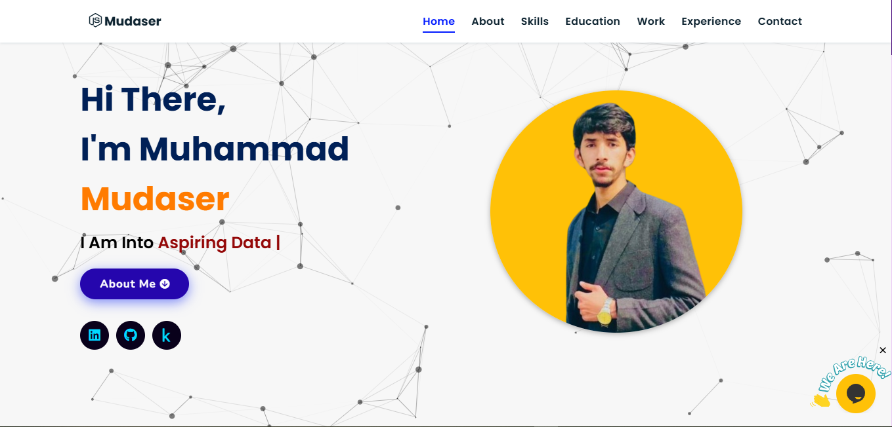

## Portfolio-Website
Portfolio website built using HTML5, CSS3, JavaScript, and jQuery.

<a href="https://jigarsable.netlify.app/" target="_blank">**Visit Now** 🚀</a>

## 📌 Tech Stack
&nbsp;
&nbsp;

### Extras : 
Particle.js, Typed.js, Tilt.js, Scroll Reveal, Tawk.to, Font Awesome and JSON

## 📌 Sneak Peek of Main Page 🙈 :

<h2>📬 Contact</h2>

Feel free to reach me through the below handles if you'd like to contact me.

